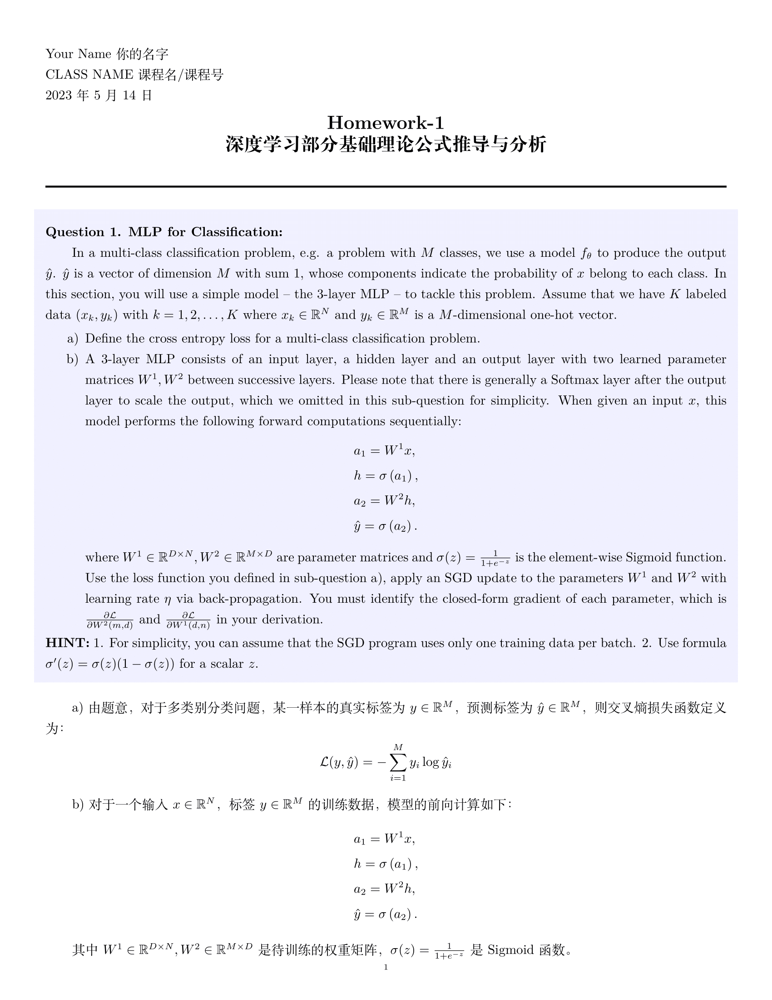
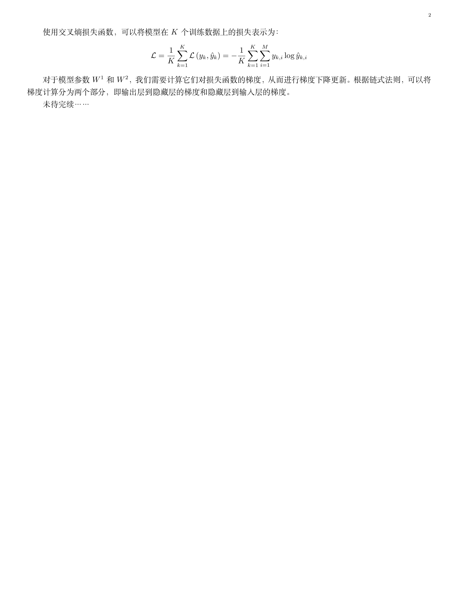
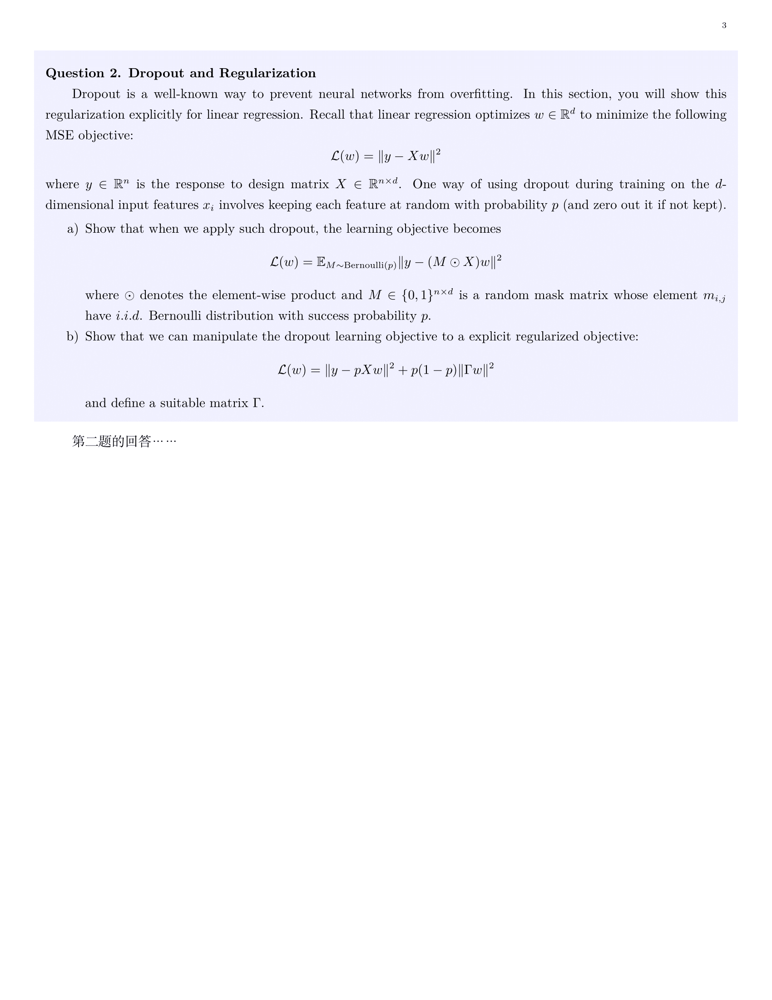
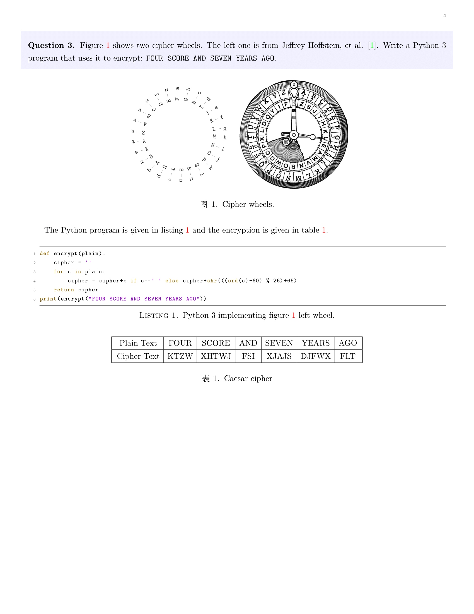

<h1 align="center">Beautiful Homework in LaTeX 美观的LaTeX作业文档模版</h1>

<strong>Forked from <a href="https://github.com/simurgh9/hw">simurgh9-hw</a> and <a href="https://www.overleaf.com/latex/templates/overleaf-homework-template/tjpxvcfnrqpd">Overleaf Homework Template</a></strong>
 对原Repo进行了瘦身美化并增加中文支持

## Main Style Files
1. [`homework.cls`][0]: A latex class extending the [AMS article](https://www.ctan.org/pkg/amsart) for better typeset homework. This class imports the next three packages for symbol shortcuts and code listings.
2. [`hwcmd.sty`][4]: A collection of shortcuts for environments like figure and tabular.
3. [`hwlst.sty`][1]: A collection of configurations and additions to the [Listings](https://www.ctan.org/pkg/listings) package.
4. [`hwsymb.sty`][2]: Defines a lot of useful shortcuts for bigger macros, e.g., `\Z` for `\mathbb{Z}`.

## Preview

  
 
 
 
 

<a href="./main.pdf">main.pdf</a>

If you want to use the LaTeX homework class `homework.cls` or one of the style packages `*.sty` (on your own computer) then you'll need to have one of the distributions of LaTeX installed and a text editor, there are some good ones for editing `*.tex` files; I use Emacs with AucTeX. For the LaTeX distribution, I recommend [TeXLive](https://tug.org/texlive/).

## Other Resources

1. [TeX Live](https://tug.org/texlive/)
2. [Dickimaw Books](https://www.dickimaw-books.com/latex/admin/html/docsvlist.shtml)
3. [Wikibooks](https://en.wikibooks.org/wiki/LaTeX)

## License

Copyright (C) 2020 Ahmad Tashfeen

This program is free software: you can redistribute it and/or modify it under the terms of the GNU General Public License as published by the Free Software Foundation, either version 3 of the License, or (at your option) any later version.

This program is distributed in the hope that it will be useful, but WITHOUT ANY WARRANTY; without even the implied warranty of MERCHANTABILITY or FITNESS FOR A PARTICULAR PURPOSE.  See the GNU General Public License for more details.

You should have received a copy of the [GNU General Public License](COPYING) along with this program.  If not, see <https://www.gnu.org/licenses/>.

[0]: https://raw.githubusercontent.com/simurgh9/hw/master/src/latex/homework.cls
[1]: https://raw.githubusercontent.com/simurgh9/hw/master/src/latex/hwlst.sty
[2]: https://raw.githubusercontent.com/simurgh9/hw/master/src/latex/hwsymb.sty
[3]: https://raw.githubusercontent.com/simurgh9/hw/master/examples/mathjax/hwjax.js
[4]: https://raw.githubusercontent.com/simurgh9/hw/master/src/latex/hwcmd.sty
